# Collection of Python scripts to build amazing things in Minecraft

## Prerequisites

`pip install mcpi`

## Usage

Clone the repo and open in vscode (or some IDE that has a concept of project directory)

## Scripts gallery

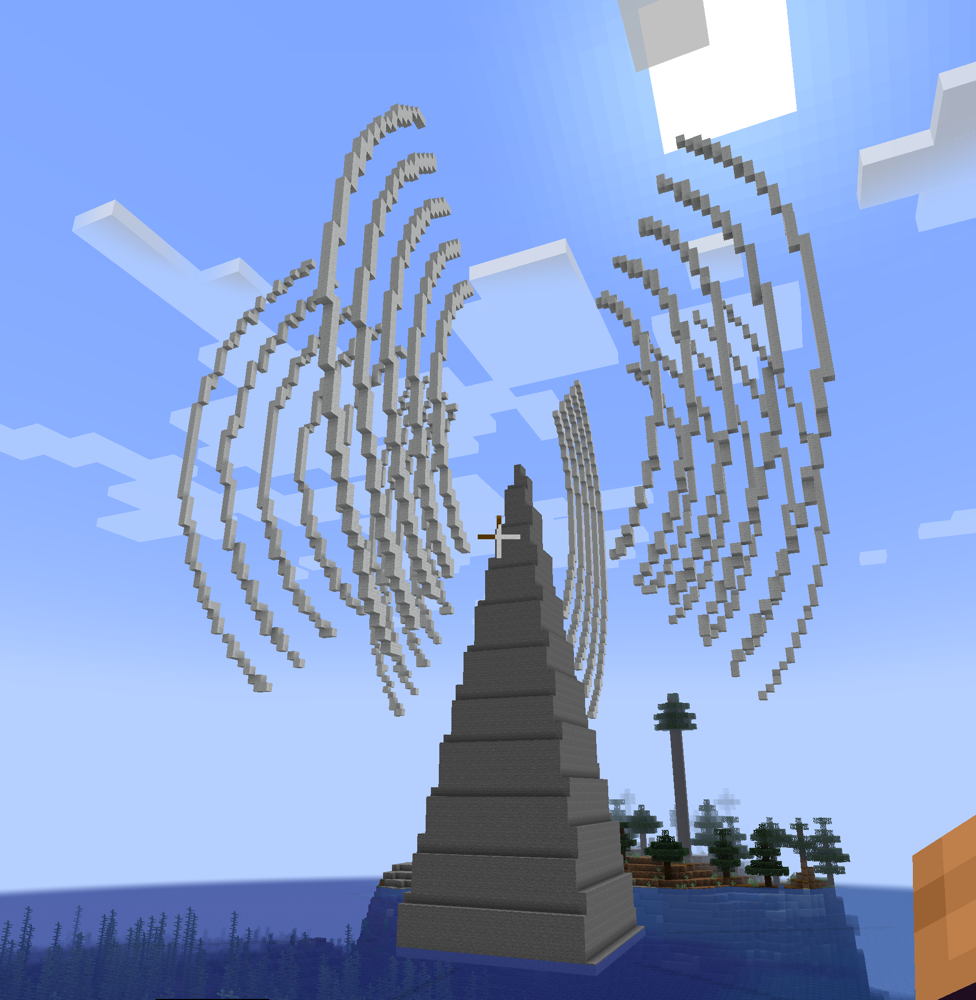
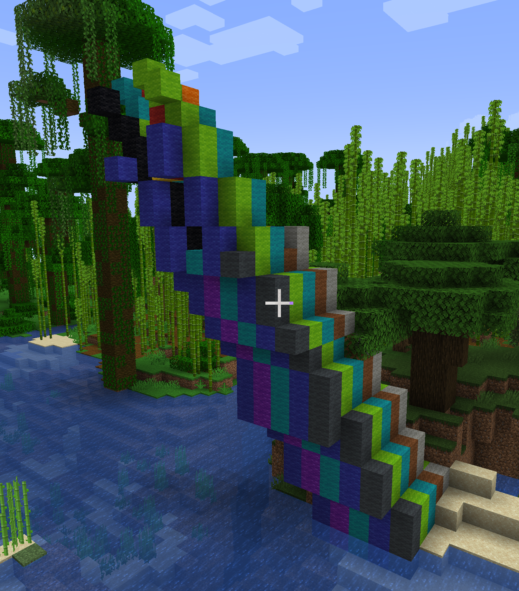
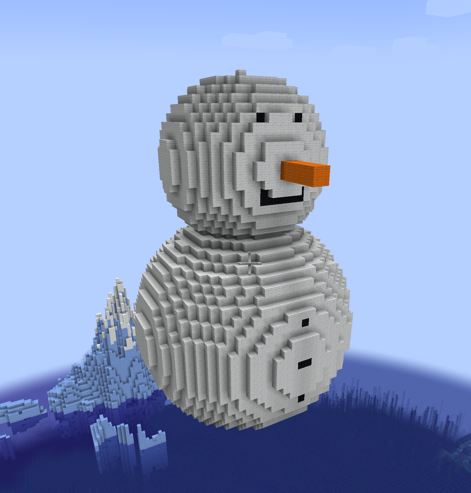
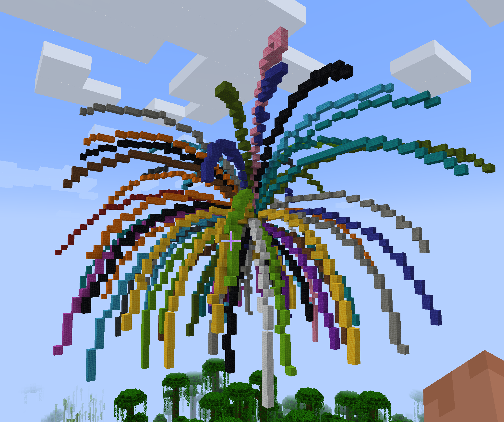
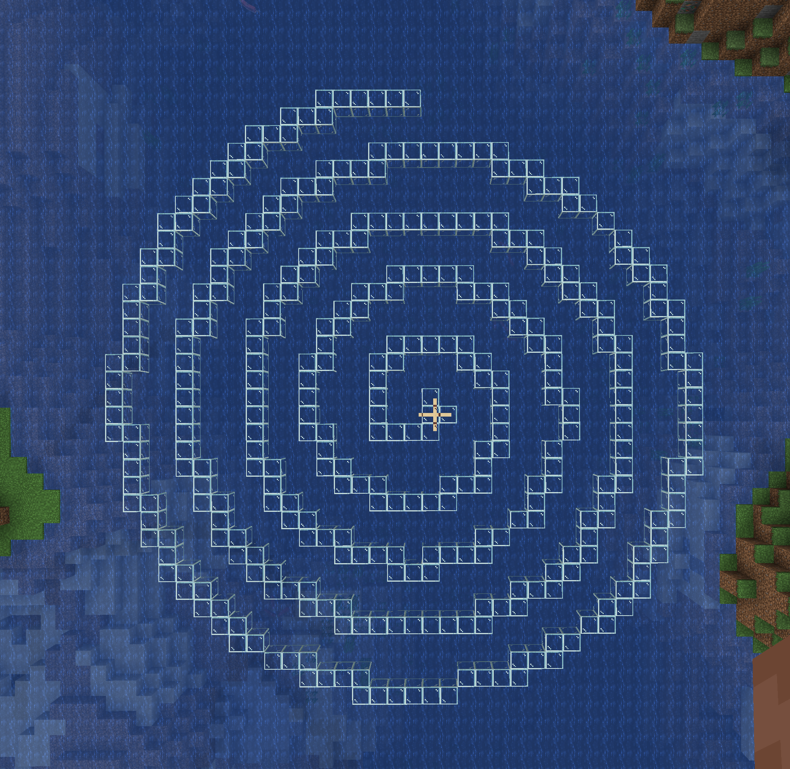
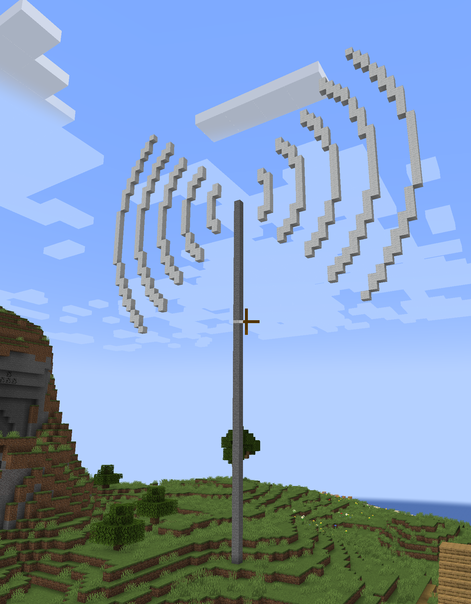
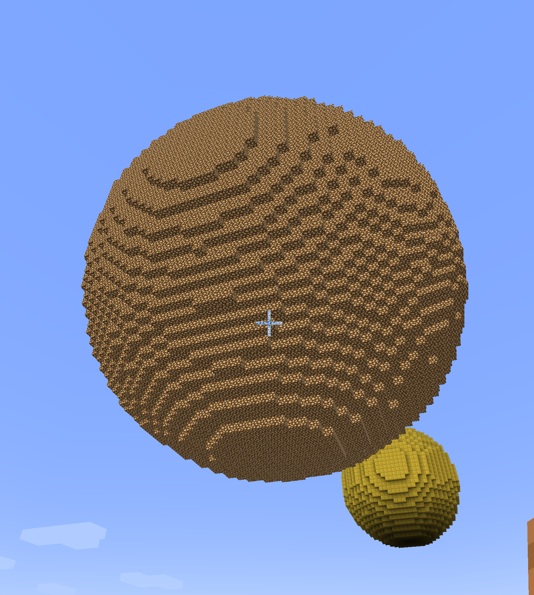
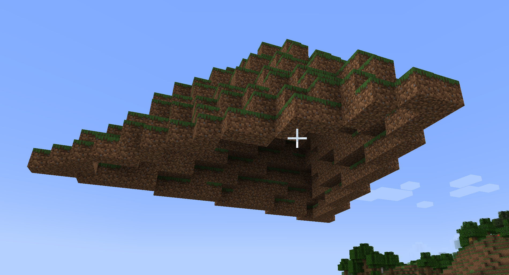
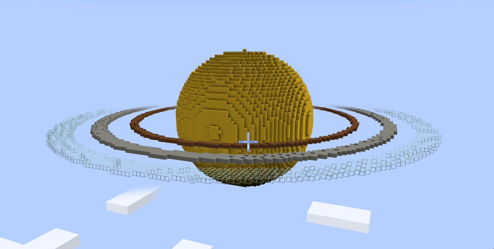
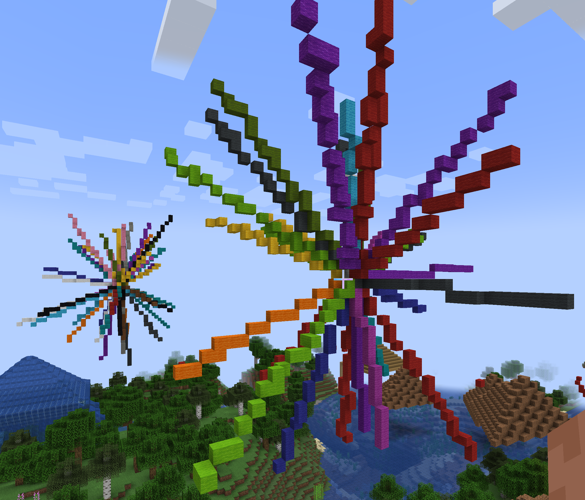
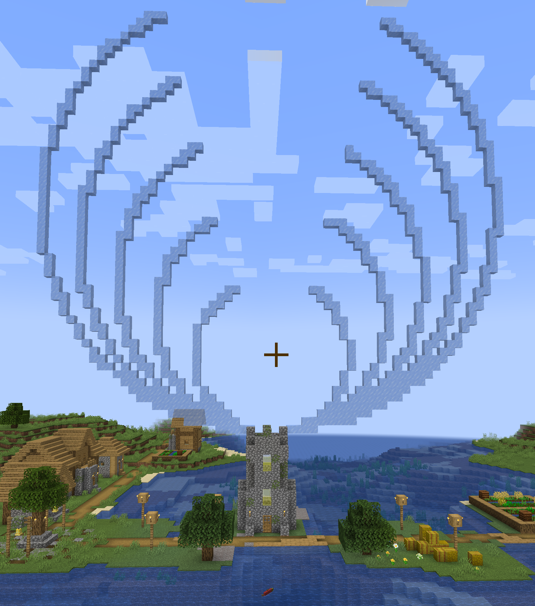
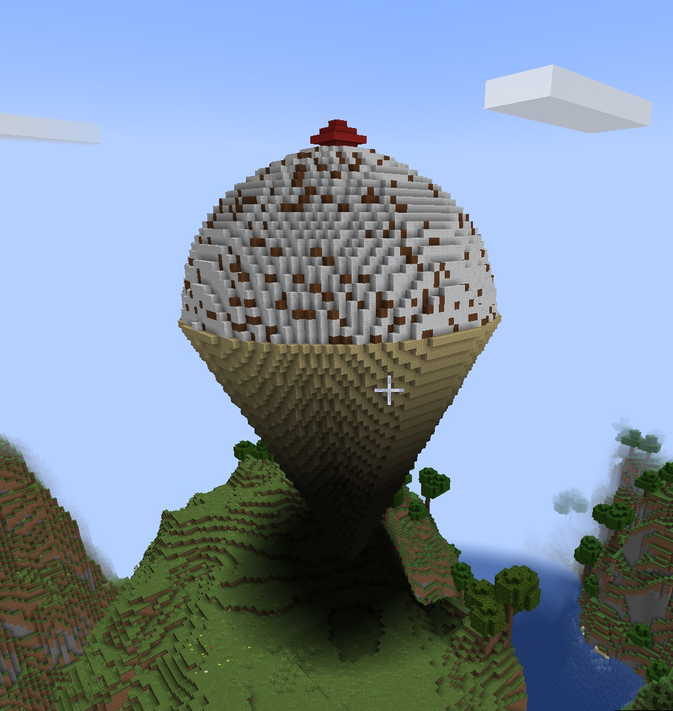

